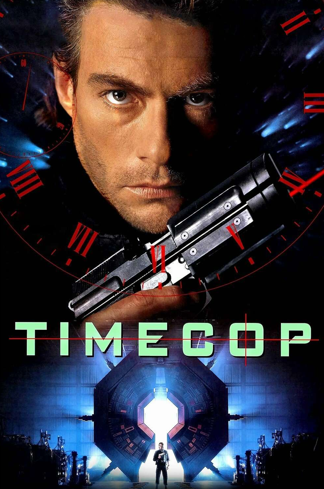

# TimeCop

*Navigate commits like Van Damme navigates time. But sitting down.*



## Screenshots

<p>


</p>
<p>


</p>

## Why

AI agents commit fast. Multiple commits per task. `git diff` against working tree is useless — you need diff against base branch.

Browser PRs, terminal, editor — too much context switching. I wanted everything in one place, in the terminal, next to the agent.

## Install

**Quick install (macOS/Linux):**
```bash
curl -fsSL https://raw.githubusercontent.com/kamilmac/timecop/main/install.sh | sh
```

**Build from source:**
```bash
git clone https://github.com/kamilmac/timecop
cd timecop
cargo build --release
cp target/release/timecop ~/.local/bin/
```

Needs Git. For PR features (list, approve, comment), install [gh CLI](https://cli.github.com/).

## Usage

```bash
timecop              # current directory
timecop /path/to/repo
```

Press `?` for keybindings.

The TIMECOP header is a timeline — use `,` and `.` to step through commits.

## License

MIT
