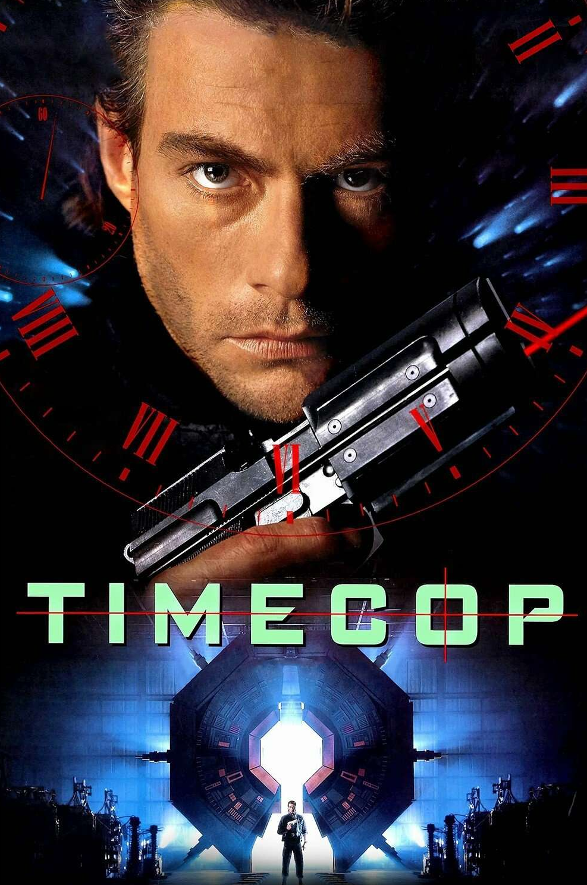

# TimeCop


"Navigate commits like Van Damme navigates time. But sitting down."

A terminal UI for reviewing pull requests and navigating commit history.



> Press `?` inside the app to see all keybindings.

## Features

- **Timeline scrubbing** — Step through commits with `,` and `.` to see how code evolved
- **Side-by-side diffs** — Compare changes against base branch or individual commits
- **PR actions** — Comment, approve, or request changes without leaving the terminal
- **All PRs in one view** — Browse open pull requests, see status, check out branches
- **Keyboard-driven** — Fast navigation, no mouse required

## Screenshot


## Install

**Quick install (macOS/Linux):**
```bash
curl -fsSL https://raw.githubusercontent.com/kamilmac/timecop/main/install.sh | sh
```

**Build from source:**
```bash
git clone https://github.com/kamilmac/timecop
cd timecop
cargo build --release
cp target/release/timecop ~/.local/bin/
```

## Requirements

- Git
- [gh CLI](https://cli.github.com/) — for PR features (list, approve, comment)

## Usage

```bash
timecop              # Run in current directory
timecop /path/to/repo
```

### Key Bindings

| Key | Action |
|-----|--------|
| `,` `.` | Step backward/forward through commits |
| `j` `k` | Navigate up/down |
| `Enter` | Select / Expand |
| `c` | Add comment |
| `a` | Approve PR |
| `x` | Request changes |
| `?` | Show all keybindings |

## License

MIT
